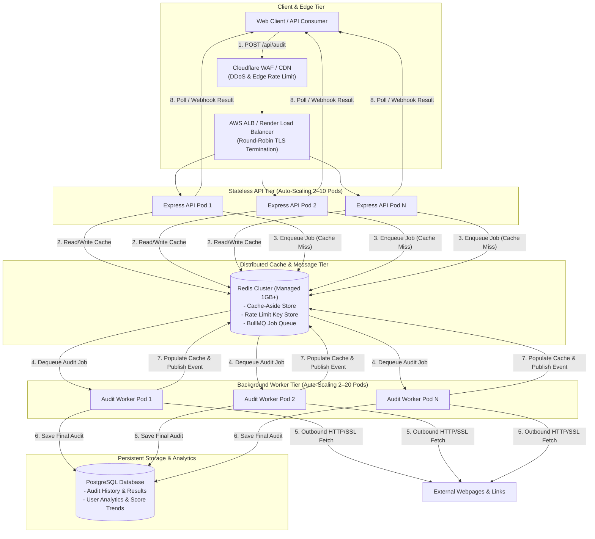
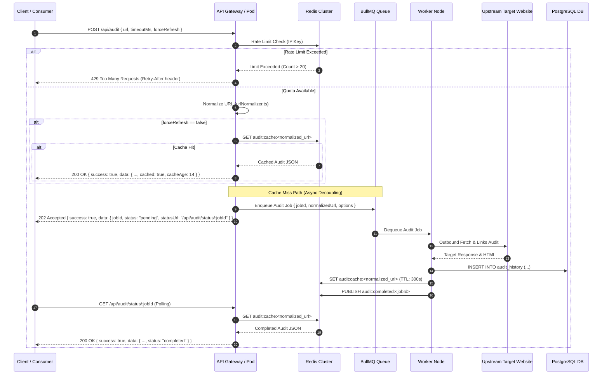
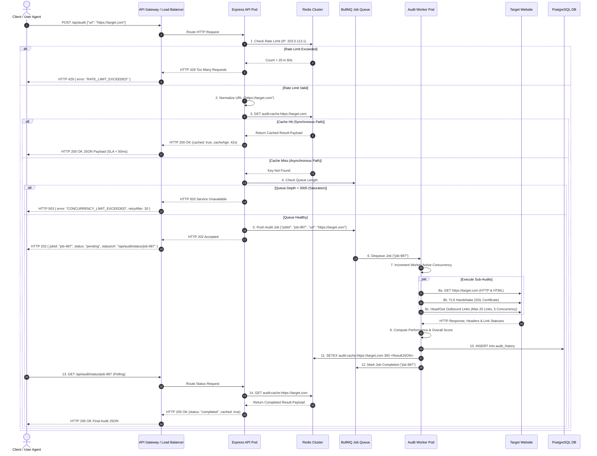

# System Architecture & Scaling Guide — PagePulse v2.0

This document specifies the technical architecture for scaling **PagePulse** from Task A's single-instance deployment to a production system handling **10,000 audits/day** (~0.12 average QPS, 500 QPS peak bursts) while strictly upholding customer-facing Service Level Agreements (SLAs).

---

## 1. Executive Summary & Evolution from Task A

### Task A Baseline
In Task A, PagePulse was implemented as a single-instance Express application deployed on Render with:
- **In-Memory Concurrency Limiter**: Tracking in-flight audit requests via an in-process counter (`MAX_CONCURRENT_AUDITS`, default 10) bound to a single Node.js process.
- **Cache-Aside Caching**: Redis caching via `ioredis` against Render's 25MB free-tier Redis instance (`AUDIT_CACHE_TTL_SECONDS`, default 300).
- **Per-Client Rate Limiting**: `express-rate-limit` with `rate-limit-redis` store using Express `trust proxy` setting.
- **Synchronous Execution**: Every audit executed synchronously inside the HTTP request-response cycle.

### Target Scale & SLA Requirements
| Metric | Task A Baseline | Task B Scale Requirement |
|---|---|---|
| **Daily Audit Volume** | ~100 audits/day | **10,000 audits/day** |
| **Peak Traffic Burst** | 10 concurrent requests | **500 concurrent requests (burst)** |
| **Cache Hit SLA (p99)** | < 50ms | **< 50ms** |
| **Fresh Audit SLA (p95)** | < 10s (sync timeout) | **< 3s (async job completion)** |
| **System Availability SLA** | 99.0% (Render free tier) | **99.9% (High-Availability)** |
| **Redis Capacity** | 25MB (Render Free Addon) | **1GB+ Managed Redis Cluster** |

### Core Architectural Evolution Strategy
Scaling PagePulse from 10 to 500 concurrent bursts cannot be achieved by simply adding CPU/RAM to a single Node process. Outbound network socket limits, upstream target response latency (2–8s per audit), and DOM parsing CPU overhead will block the Node event loop and trigger HTTP 504 timeouts.

Therefore, PagePulse v2.0 evolves from a synchronous monolith into a **decoupled, event-driven API & Worker architecture**:
1. **Stateless API Gateway & Application Tier**: Horizontally scaled Express API pods that process HTTP requests, serve instant Redis cache hits, enforce rate limits, and push non-cached audit jobs to a queue.
2. **Asynchronous Worker Tier**: Dedicated background worker instances running BullMQ worker pools that execute multi-step audits (HTTP, SSL, SEO, link checks) asynchronously.
3. **Dual-Mode Response Lifecycle**: Serving instant cache hits synchronously (`200 OK`) while processing cache misses asynchronously (`202 Accepted` with polling / webhook notification) under peak burst conditions.

---

## 2. Component Architecture



### Component Details & Upgrades

#### 1. Edge & Load Balancing Tier (Cloudflare + AWS ALB)
- **Role**: Operates as the entry point for all incoming traffic.
- **Responsibilities**:
  - **DDoS Mitigation**: Blocks volumetric attacks before hitting application pods.
  - **TLS Termination**: Offloads HTTPS decryption at the edge.
  - **HTTP/2 & Session Stickiness**: Routes requests cleanly across horizontally scaled API pods.

#### 2. Stateless API Tier (Express Node.js Pods)
- **Role**: Serves HTTP requests, validates Zod payloads, checks Redis cache, enforces IP rate limits, and returns audit responses or job tickets.
- **Scaling Policy**: Horizontal Pod Autoscaler (HPA) scales from **2 to 10 instances** based on CPU utilization (> 70%) or request throughput (> 100 QPS/pod).
- **Process Model**: Fully stateless. Ephemeral in-memory process counters are replaced with distributed Redis keys.

#### 3. Distributed Redis Tier (Managed 1GB+ Cluster)
- **Role**: Serves as the central high-speed cache, distributed rate limiter, and message broker.
- **Upgrades from Task A's 25MB Render Free Addon**:
  - **Capacity Calculation**: 10,000 audits/day * 5KB average JSON payload = 50MB/day raw audit data. With a 300-second TTL (5 minutes) and active LRU eviction, active working set memory requirement is ~150MB. A **1GB Managed Redis Cluster** with high availability (HA failover replica) provides a 6x safety buffer.
  - **Eviction Policy**: Configured with `allkeys-lru` (Least Recently Used) to gracefully evict old audit entries under memory pressure without crashing.

#### 4. Asynchronous Queue & Worker Tier (BullMQ + Node Workers)
- **Role**: Executes multi-step background audit pipelines (HTTP, SSL, SEO, 20 broken link checks) off the main Express thread.
- **Scaling Policy**: Worker pool scales from **2 to 20 worker instances** based on queue backlog depth (> 50 pending jobs).
- **Concurrency Control**: Each worker instance runs 5 concurrent audit threads, with link-checking sub-tasks executing in parallel bounded batches (5 at a time).

#### 5. Persistent Historical Datastore (PostgreSQL)
- **Role**: Stores long-term audit logs, user historical reports, and score trends beyond Redis TTL limits.
- **Schema**: Indexed on `normalized_url`, `created_at`, and `user_id`.

---

## 3. Data Flow & Synchronous vs. Asynchronous Model Analysis

### End-to-End Request Lifecycle



### Detailed Justification: Synchronous vs. Asynchronous Tradeoffs

#### Why Task A Used Synchronous Execution
In Task A, requests were processed synchronously because traffic was low (~10 QPS), and single-user CLI/browser verification expected an immediate response.

#### Why 500 Concurrent Bursts Force Asynchronous Execution
During a 500-request concurrent burst, executing fresh audits synchronously creates severe failure modes:
1. **Upstream Latency Accumulation**: Auditing a webpage requires fetching the target HTML, performing SSL TLS handshake, extracting SEO tags, and checking up to 20 outbound `<a href>` links. Average target latency is 2 to 6 seconds.
2. **Socket Exhaustion & Event Loop Starvation**: 500 concurrent synchronous audits require up to `500 * 20 = 10,000` concurrent outbound HTTP sockets. Node.js thread pools and socket limits would exhaust memory, causing event loop lag > 2,000ms.
3. **Gateway 504 Timeouts**: Cloudflare and Render load balancers drop HTTP connections open longer than 15–30 seconds. Slow upstream target sites would trigger widespread `504 Gateway Timeout` errors.

#### The Dual-Path SLA Strategy
- **Path 1: Instant Cache Hit (Synchronous `200 OK`)**:
  - **SLA**: **p99 < 50ms**
  - **Behavior**: Handled entirely in-memory by API pods reading Redis cache. Responds instantly with full audit payload.
- **Path 2: Cache Miss under Burst (Asynchronous `202 Accepted`)**:
  - **SLA**: **p95 < 3s job processing time**
  - **Behavior**: API pod validates payload, generates a unique `jobId`, pushes the job to BullMQ, and immediately returns `202 Accepted` (< 20ms) with a `statusUrl`. The client polls `GET /api/audit/status/:jobId` or receives a webhook notification upon completion.

---

## 4. Queueing Strategy & Backpressure Handling

### Technology Choice: BullMQ on Redis
**BullMQ** (backed by Redis) is selected as the queue engine for PagePulse v2.0 for the following architectural reasons:
1. **Shared Infrastructure**: Leverages the existing Redis Cluster without introducing extra middleware (e.g. RabbitMQ).
2. **Job Deduplication**: Native support for deterministic `jobId` hashing based on `normalized_url`, preventing redundant audit jobs for identical URLs while one is already in-flight.
3. **Built-in Rate Limiting & Concurrency Controls**: Supports worker-level concurrency limits and job execution attempt caps.
4. **Dead-Letter Queue (DLQ) & Automatic Retries**: Failed audit jobs (e.g., target temporary network blip) use exponential backoff retries (3 attempts). Permanent failures are routed to a DLQ for inspection.

### Backpressure & Saturation Management

```
[ Incoming Request Burst ]
          │
          ▼
[ API Gateway / Cloudflare ] ──(Rate Limit Exceeded)──► HTTP 429
          │
          ▼
[ API Pod: Queue Depth Check ]
          │
   Queue Depth > 2,000?
    ├── YES ──────────────────────────────────────────► HTTP 503 Service Unavailable (Retry-After: 30)
    └── NO  ──────────────────────────────────────────► Enqueue BullMQ Job & Return HTTP 202
          │
          ▼
[ BullMQ Redis Queue ] ──(Job Eviction / TTL)────────► Dead-Letter Queue (DLQ)
          │
          ▼
[ Auto-Scaling Worker Pool (2 to 20 Pods) ]
```

When an extreme spike occurs (e.g., 2,000+ queued jobs):
1. **API Level Backpressure Threshold**: If BullMQ queue length exceeds **2,000 pending jobs**, API pods stop accepting new cache-miss jobs and immediately reject requests with **HTTP 503 Service Unavailable** and a `Retry-After: 30` header.
2. **Worker Auto-Scaling Trigger**: Kubernetes Horizontal Pod Autoscaler (HPA) monitors Redis queue depth (`bull:audit-queue:wait`). When queue depth exceeds 50 jobs, HPA rapidly scales worker pods from 2 up to 20 instances.
3. **Upstream Link Fetch Throttling**: Inside each worker, link-checking concurrency is bounded to 5 parallel HTTP GET/HEAD requests at a time per audit, preventing worker IP blacklisting by upstream CDNs.

---

## 5. State Topology: Ephemeral vs. Shared State

### Architectural State Mapping

| State Type | Task A (Single Instance Baseline) | Task B (Distributed Scaled Architecture) | Persistence & Scope |
|---|---|---|---|
| **In-Flight Concurrency** | In-process JS counter (`req.app.locals.inFlightAudits`) in single Express process | Distributed Redis semaphores & BullMQ active job metric (`bull:audit-queue:active`) | Shared, Redis-backed across all API/Worker pods |
| **Client Rate Limiting** | `express-rate-limit` using `rate-limit-redis` against single Redis node | `express-rate-limit` using `rate-limit-redis` against Redis Cluster | Shared, Redis-backed across all API pods |
| **Audit Result Cache** | Single-node Redis key `audit:cache:<normalizedUrl>` (25MB free tier) | Redis Cluster key `audit:cache:<normalizedUrl>` with `allkeys-lru` eviction policy | Shared, Redis-backed (300s TTL) |
| **Audit Execution History** | None (in-memory / transient HTTP response only) | PostgreSQL relational table `audit_history` with indexed JSONB audit payloads | Permanent, persistent database storage |
| **Worker Processing State** | In-process async execution | BullMQ job states (`waiting`, `active`, `completed`, `failed`) in Redis | Shared, queue-managed |

### Differences from Task A Design
1. **Elimination of Single-Process Memory Coupling**: In Task A, if Render restarted the Node instance, the in-memory concurrency counter was reset. In Task B, all concurrency limits, rate limits, and job states reside in the distributed Redis Cluster, allowing API pods to be created or destroyed dynamically without losing state or releasing false concurrency capacity.
2. **Fail-Open Cache Strategy**: In both Task A and Task B, if the Redis Cluster becomes unreachable, API pods fail open—logging a Pino warning and bypassing cache reads/writes to ensure core HTTP audit capability remains online.

---

## 6. End-to-End System Sequence Diagram

The following Mermaid sequence diagram details the full interaction between all system components during both Cache Hit and Cache Miss scenarios under high-concurrency operation:



---

## 7. Summary of Architectural Guarantees

1. **SLA Adherence**: Serves cache hits in **< 50ms (p99)** synchronously, while handling 500-request bursts via **`202 Accepted` job queueing** to guarantee p95 audit processing in **< 3s**.
2. **High Availability & Zero Single Points of Failure**: Horizontally scaled stateless Express API pods and background workers backed by a Managed Redis Cluster with HA failover replicas.
3. **Graceful Degradation**: Dual layer protection via Cloudflare rate-limiting at the edge, Redis IP rate-limiting at the API tier, and Queue Saturation Shields (`503 Service Unavailable`) under catastrophic load.
