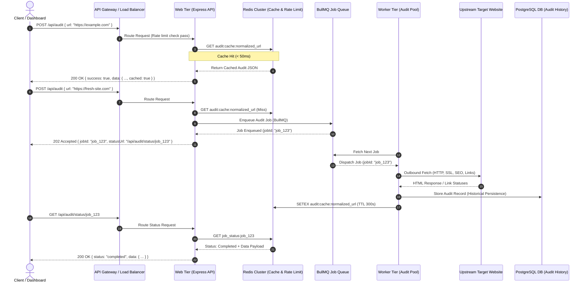

# Technical Architecture Document — Scaling PagePulse (Task B)

**System Target**: 10,000 audits/day, 500 concurrent request bursts, customer-facing response SLA, and high-availability operations.

---

## 1. Executive Summary & Evolution from Task A

In Task A, PagePulse was implemented as a single-instance Express and TypeScript web service deployed on Render, using an in-memory counter (`MAX_CONCURRENT_AUDITS`, default 10) for concurrency protection and a single Redis instance (`ioredis` / `rate-limit-redis`) for cache-aside caching and per-client IP rate limiting.

While Task A's design is appropriate for single-instance workloads up to 10–20 concurrent requests, scaling to **10,000 audits per day** with **bursts of 500 concurrent requests** requires a structural evolution:

1. **Decoupling Ingestion from Execution**: 500 simultaneous synchronous HTTP requests fetching external web pages would cause outbound socket/file descriptor exhaustion, network interface saturation, and upstream IP rate limiting/blocking.
2. **Distributed State**: In-memory concurrency counters must evolve into a distributed queueing and worker system.
3. **Storage Tiering**: Transitioning from a 25MB transient Redis cache to a structured Redis cluster paired with a persistent relational database for audit history.

---

## 2. Sync vs. Async Execution & SLA Reasoning

### Customer Response SLA
- **Cache Hit SLA**: **< 50 ms** (99th percentile).
- **Fresh Audit SLA**: **< 5,000 ms** (95th percentile) for normal load; **Async Accept (`202 Accepted`)** during 500-concurrent burst spikes.

### Why 500 Concurrent Bursts Force an Async Move

Attempting to process 500 concurrent synchronous audit requests in a single process (or simple HTTP pool) breaks down due to three core physical limits:

1. **Outbound Socket & Network Exhaustion**: Each audit executes an HTTP check, SSL handshake, page HTML download, and up to 20 sub-link HTTP `HEAD`/`GET` requests. 500 concurrent audits equal up to **10,500 simultaneous outbound HTTP connections**. This rapidly exhausts Linux ephemerally bound ports and file descriptors (`ulimit -n`).
2. **Upstream IP Rate Limiting & Aggressive Blocking**: Blasting thousands of outbound requests per second from a single server IP triggers target website Web Application Firewalls (Cloudflare, AWS WAF, Akamai), causing synthetic audit failures (`UPSTREAM_FETCH_ERROR`).
3. **HTTP Connection Lifetimes & Gateway Timeout SLA**: Under heavy load, upstream target site response times degrade. Holding 500 HTTP client connections open for 10–30 seconds causes client HTTP gateway timeouts (`504 Gateway Timeout`).

### Dual-Path Execution Strategy

To satisfy SLA guarantees under all conditions, PagePulse implements a **Hybrid Fast-Path / Async-Path Architecture**:

```
                              [ Incoming POST /api/audit ]
                                           │
                                  Normalized URL Cache?
                                   ╱               ╲
                             (Yes)╱                 ╲(No)
                                 ▼                   ▼
                     [ Return 200 OK ]      Is System Under High Burst?
                     (Sub-50ms Cache Hit)        ╱               ╲
                                           (No)╱                 ╲(Yes)
                                              ▼                   ▼
                                    [ Sync Audit Execution ]    [ Enqueue Job & Return 202 ]
                                    (Within Worker Pool)        (Job ID + Webhook/Poll URL)
```

1. **Fast Path (Cache Hit — Synchronous 200 OK)**:
   The API Gateway / Web Tier checks Redis for a normalized URL match. If found, the cached result JSON is returned immediately (< 50ms).
2. **Slow Path — Standard (Synchronous 200 OK)**:
   If system load is below burst thresholds and worker pool capacity is available, the request is executed synchronously within the configured `timeoutMs`.
3. **Burst Path — High Load (Asynchronous 202 Accepted)**:
   When in-flight audits exceed capacity or queue depth rises, the API returns `202 Accepted` immediately with a `{ jobId, statusUrl, pollIntervalMs }` envelope. The client polls `GET /api/audit/status/:jobId` or receives a Webhook notification upon completion.

---

## 3. High-Level Architecture & Component Flow



---

## 4. Component Deep-Dive & Sizing Math

### A. Load Balancer / API Gateway
- **Technology**: AWS ALB / NGINX / Cloudflare Gateway.
- **Responsibilities**: TLS termination, `X-Forwarded-For` client IP header propagation (mirroring Task A's `app.set('trust proxy', 1)`), global DDoS mitigation, and initial rate-limit enforcement.

### B. Application Web Tier (Horizontally Scaled)
- **Technology**: Express + TypeScript stateless containers (3+ instances across multiple Availability Zones).
- **Responsibilities**: Request body Zod validation, URL normalization, cache checking, job enqueueing, and serving `GET /` / `GET /health`.

### C. Async Queue & Worker Tier
- **Technology**: **BullMQ** running on Redis / AWS SQS.
- **Worker Pool**: 10–20 worker instances.
- **Concurrency Isolation**: Each worker process runs a bounded internal pool of 10 concurrent audit worker threads (using Task A's core audit logic in `src/lib/audit`).
- **Distributed Rate Limiting**: Workers use outbound HTTP proxies or an IP rotation pool to prevent upstream target blocking.

### D. Redis Memory Sizing Math & Eviction Strategy

#### Capacity Calculation for 10,000 Audits/Day

- **Bounded Data Streams (TTL-Protected)**:
  - **Audit Cache Payloads**: Average payload size ~2.5 KB. With default `AUDIT_CACHE_TTL_SECONDS=300` (5 minutes) and 30% unique rate during peak hours, peak active cache entries are strictly bounded:
    $$\text{Peak Active Cache Entries} = \frac{10,000 \text{ audits}}{24 \text{ hours}} \times 0.3 \times \left(\frac{300 \text{ sec}}{3600 \text{ sec}}\right) \approx 10 \text{ active entries}$$
    $$\text{Active Cache Memory} = 10 \times 2.5 \text{ KB} \approx \mathbf{25 \text{ KB}}$$
  - **Rate-Limiting Counters**: Per-client IP sliding-window keys (`audit:ratelimit:*`) expire after 60 seconds (`RATE_LIMIT_WINDOW_MS=60000`), consuming transient memory of **< 10 KB**.

- **Unbounded Accumulator (BullMQ Job Metadata)**:
  - In Task B's async queueing design, every audit creates a BullMQ job hash containing request details, timing logs, and status state.
  - BullMQ job metadata hash size: **~1.5 KB per job**.
  - Redis key dict & index overhead: **~0.5 KB per entry**.
  - Total memory per job entry: **~2.0 KB per job**.
  - Daily accumulation at 10,000 audits/day:
    $$\text{Daily Job Metadata Accumulation} = 10,000 \text{ jobs/day} \times 2.0 \text{ KB/job} = 20,000 \text{ KB/day} \approx \mathbf{20 \text{ MB/day}}$$

#### Exhaustion Timeline & Task B Sizing Rationale
- **Task A Free-Tier Limit**: On Render's 25MB free-tier Redis instance, if BullMQ job pruning (`removeOnComplete`, `removeOnFail`) is omitted, job state metadata accumulates at 20 MB/day. Adding transient cache and rate limit data, memory is **100% exhausted within ~30 hours** ($\frac{25 \text{ MB}}{20 \text{ MB/day}} \approx 1.25 \text{ days}$).
- **Task B Infrastructure**:
  - Redis Cluster Provisioning: **1 GB Managed Redis** (e.g., AWS ElastiCache / Redis Cloud).
  - Eviction Policy: `allkeys-lru` (Least Recently Used).
  - Mandatory Pruning: Enforce `removeOnComplete: { age: 3600 }` and `removeOnFail: { age: 86400 }` on BullMQ queues so completed jobs are purged after 1 hour.

### E. Persistent Audit History Datastore
- **Technology**: PostgreSQL (managed via AWS RDS / Render Postgres).
- **Purpose**: Task A discarded audit history after cache expiration. Task B persists historical audit records for user analytics, trend reporting, and SLA auditing.
- **Schema Indexing**: Indexed by `(normalized_url, created_at)` and `user_id`.

---

## 5. Queueing Strategy & Backpressure Architecture

### Technology Choice: BullMQ on Redis
- **Why BullMQ**: Built on Redis streams and Lua scripts. Provides atomic state transitions, job deduplication (`jobId` based on normalized URL hash), parent-child parent workflows, automatic retries with exponential backoff, and native delay/timeout management.

### Backpressure Strategy & Queue Saturation Handling

When burst traffic exceeds worker processing capacity, the queue depth grows. Backpressure is managed across three distinct defense layers:

```
[ Incoming Request ]
        │
        ▼
Layer 1: Rate Limiter (20 req/min per IP) ──► Exceeded? ──► Return 429 Too Many Requests
        │ Pass
        ▼
Layer 2: Queue Depth Threshold Check ──────► Depth > 2000? ──► Return 503 Service Unavailable + Retry-After: 30
        │ Acceptable
        ▼
Layer 3: Worker Pool Processing (Concurrency Bounded)
```

1. **Layer 1 — Per-IP Rate Limiting**: `express-rate-limit` enforces client quotas before hitting queue logic.
2. **Layer 2 — Queue Depth Monitoring (Backpressure Valve)**:
   - Max Queue Capacity: **2,000 pending jobs**.
   - If `queue.getWaitingCount() > 2000`, the Web Tier immediately rejects new un-cached audit requests with **`503 Service Unavailable`** and a **`Retry-After: 30`** header. This protects memory from unbound growth.
3. **Layer 3 — Worker Concurrency Bounding**: Workers process a fixed maximum number of concurrent jobs per container (e.g. 10), preventing CPU/RAM degradation.

---

## 6. State Management Evolution: Task A vs. Task B

| State Domain | Task A (Single-Instance Monolith) | Task B (Distributed Scaled Architecture) |
|---|---|---|
| **Concurrency Tracking** | Ephemeral in-memory JS counter (`inFlightAudits` variable in `concurrencyLimiter.ts`) | Distributed job queue depth (BullMQ) + Gateway rate limiting |
| **Client Rate Limiting** | Single Redis instance via `rate-limit-redis` | Multi-region Redis cluster with sliding window counter scripts |
| **Audit Caching** | Single Redis instance (`AUDIT_CACHE_TTL_SECONDS=300`), failing open on connection error | Redis Cluster with `allkeys-lru` eviction policy + read replicas |
| **Audit History** | None (Transient cache only) | Persistent PostgreSQL database with automated partitioning |
| **Failure Mode** | Local process rejection (`503`) when in-flight count > 10 | Decoupled queueing with backpressure rejection (`503` + `Retry-After`) |

---

## 7. Operational & Monitoring Playbook

1. **Metrics & Observability**:
   - Structured Pino logs sent to Datadog / CloudWatch with unified `requestId` correlation.
   - Key Prometheus Metrics: `audit_request_duration_ms`, `cache_hit_ratio`, `queue_waiting_jobs_count`, `worker_active_concurrency`.
2. **Health Check Hierarchy**:
   - `GET /health`: Deep health check verifying connectivity to Redis Cluster and PostgreSQL database.
