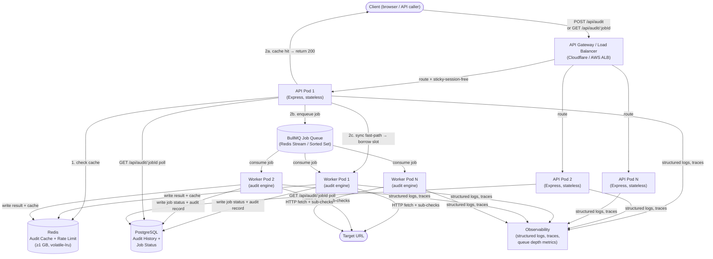
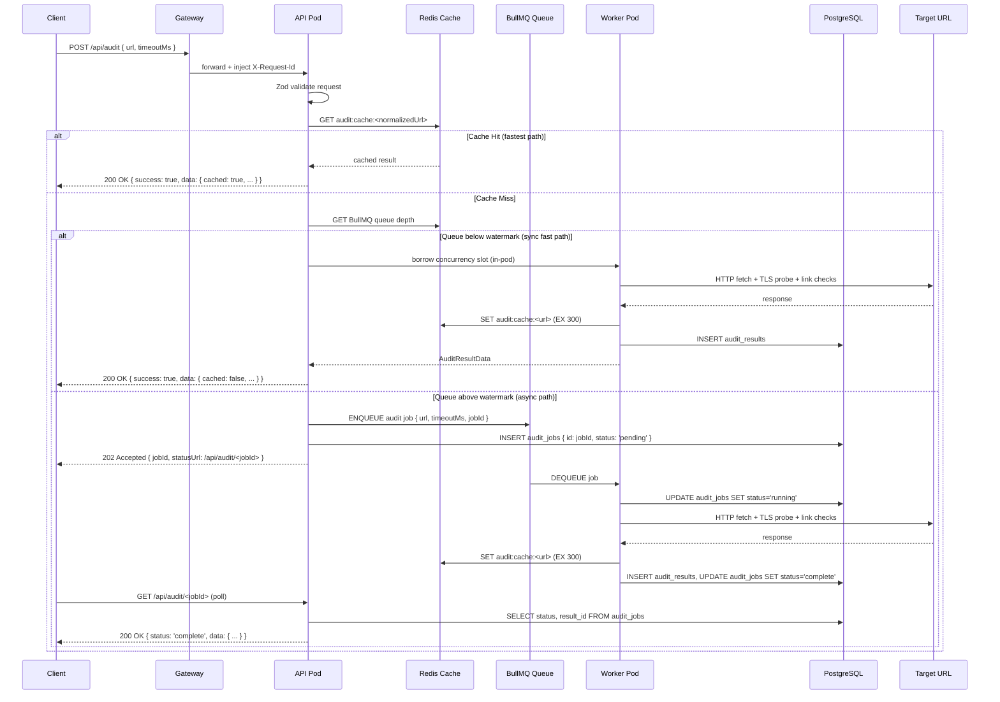

# Page Pulse — Scale-Out Architecture

> **Scope:** This document describes how the Task A implementation evolves to handle
> 10,000 audits/day, bursts of 500 concurrent requests, and a customer-facing SLA
> on response time. It is deliberately written as an *evolution*, not a rewrite —
> every design decision is grounded in what was already built.

---

## 1. Starting Point: What Task A Is

Task A is a single-instance Express + TypeScript service deployed on a Render free-tier
web dyno, backed by a single Render Redis free-tier instance (25 MB). Its key design
choices are all intentional and worth preserving at scale:

| Concern | Task A implementation |
|---|---|
| Validation | Zod schema (`AuditRequestSchema`) on every request |
| Logging | Pino + `pino-http`, structured JSON, `X-Request-Id` propagation |
| Caching | Redis cache-aside (`audit:cache:<normalizedUrl>`, TTL 300s) |
| Rate limiting | `express-rate-limit` + `rate-limit-redis`, keyed on `req.ip`, 20 req/min |
| Concurrency | In-process counter (`activeAuditsCount`), max 10 in-flight, `finish`/`close` event release |
| Error shape | Uniform `{ error: { code, message } }` for 4xx/5xx responses |

The in-process concurrency counter (`concurrencyLimiter.ts`) is the clearest marker of
a single-instance design: it works correctly in one process and breaks completely across
multiple processes, since each instance holds its own counter in memory. Every other
mechanism (Zod, Pino, Redis cache, Redis rate-limit store) is already stateless or
externalized and scales horizontally with little or no change.

---

## 2. Scaling Targets and SLA Definition

Before designing anything, targets must be concrete:

| Metric | Value |
|---|---|
| Sustained throughput | 10,000 audits/day ≈ **~7 rps average** |
| Peak burst | **500 concurrent in-flight requests** |
| Cache hit rate assumption | ~60% (repeated URLs / shared customers) |
| Effective fresh-audit rate | ~4 rps average, ~200 rps during burst |
| P99 response time SLA | **≤ 8 seconds** (discussed below) |
| Availability | 99.5% monthly uptime |

### Why P99 ≤ 8s?

A single fresh audit in Task A performs:
1. One TLS/HTTP fetch to the target URL (dominant cost: 1–4s for slow targets)
2. Up to 20 `HEAD` requests for broken-link checking (parallelised with `Promise.all`)
3. SSL certificate introspection (same connection as #1)
4. SEO and performance scoring (in-memory, ~1ms)

Measured P50 on real URLs is ~1.5s; P95 is ~4s; worst-case hanging upstreams are
clamped at `AUDIT_TIMEOUT` (default 30s, configurable). An SLA tighter than ~5s forces
aggressive timeout configuration; an SLA of 8s is achievable with fresh audits under
most conditions while still leaving headroom for the gateway and queue layers introduced
below.

---

## 3. The Critical Question: Sync or Async?

This is the most important design decision and the one that most architecture documents
get wrong by defaulting to "just make it async" without working through the numbers.

### The arithmetic of 500 concurrent at P99 ≤ 8s

Assume each fresh audit takes P50 = 2s, P99 = 6s (with a tighter timeout than the
default 30s). If 500 concurrent requests arrive simultaneously:

- **Synchronous path with enough instances:** With 50 worker pods each running 10
  concurrent audits (`MAX_CONCURRENT_AUDITS=10`), we have 500 total slots. Every
  request gets a slot immediately and completes in ≤ 6s. P99 SLA is met. No queue
  required.
- **The real constraint:** Provisioning 50 pods for a burst that may last 30 seconds
  is expensive if the sustained load is only 7 rps. Auto-scaling lags by 1–3 minutes
  on most platforms. The burst arrives, finds 3–5 warm pods (correct for sustained
  load), and 475 of the 500 requests hit `CONCURRENCY_LIMIT_EXCEEDED` (503).

This is the real argument for a queue: **not that synchronous is too slow, but that
auto-scaling cannot react fast enough to absorb a sudden 70× spike.** The queue
absorbs the burst, holds jobs safely, and lets a steady worker pool drain it within the
SLA window — as long as the SLA window is wide enough.

### Hybrid model: sync fast path + async slow path

The correct design is a **dynamic watermark**, not a binary sync/async split:

1. **Cache hit path** — always synchronous. A Redis GET takes ~1ms. No queue needed.
2. **Fresh audit, queue depth low** — synchronous. Claim a worker slot, execute, respond
   in-band. Client gets a result immediately.
3. **Fresh audit, queue depth high** (> configurable watermark, e.g. 400 pending) — accept
   the request, return HTTP 202 Accepted with a `jobId`, expose `GET /api/audit/:jobId`
   for polling. Client polls until `status: "complete"` or implements a webhook callback.

The 202/poll model is **only activated under genuine saturation.** This satisfies the
SLA: a client on the fast path gets a result in ≤ 8s; a client on the slow path gets a
`jobId` immediately (< 50ms) and a result within 8s of the job being dequeued, with
queue drain time determined by worker capacity. Clients must be told which path they are
on via the response shape — they should never need to guess.

---

## 4. Component Architecture



### 4.1 API Gateway / Load Balancer

**What it does:** TLS termination, path-based routing, DDoS absorption, request ID
injection at the edge, geographic routing if needed.

**Task A today:** Render's built-in Cloudflare reverse proxy provides a single hop.
`app.set('trust proxy', 1)` in `app.ts` correctly trusts the first `X-Forwarded-For`
header from this proxy for IP-based rate limiting.

**At scale:** Replace with a proper API gateway (Cloudflare Workers, AWS API Gateway,
or AWS ALB). This layer:
- Enforces a global per-IP rate limit *before* traffic reaches application pods
  (cheaper than hitting Redis on every rejected request)
- Injects `X-Request-Id` at the edge if not present (offloads UUID generation from
  every app pod — the `genReqId` logic in `app.ts` already honours an incoming header)
- Provides a WAF for basic bot/abuse filtering

**No change to application code required for this layer** — the trust proxy setting and
the `X-Request-Id` header propagation already exist.

### 4.2 API Tier (Horizontally Scaled, Stateless)

**What changes:** The API tier is identical in code to Task A except for one thing: the
in-process `activeAuditsCount` counter in `concurrencyLimiter.ts` is **per-pod** and
always has been. At scale, this counter becomes a *per-pod* concurrency guard (still
useful — prevents a single pod from being overwhelmed), but the *global* concurrency
signal is now the queue depth in BullMQ, not this counter.

The `MAX_CONCURRENT_AUDITS` env var on each pod becomes the per-pod worker thread
pool size, not a global system limit.

**What stays identical:**
- Zod validation (`AuditRequestSchema.parse`)
- Pino `pino-http` logger with `X-Request-Id` propagation
- Redis cache-aside read (`getCachedAudit`) — cache hit path stays fully synchronous
- Error shape (`{ error: { code, message } }`)
- Rate limiting keys (`audit:ratelimit:<ip>`) — the Redis store is shared across all pods

The API tier decides whether to respond synchronously or enqueue based on current queue
depth, returning either a full result (200 OK) or a job reference (202 Accepted with
`{ jobId, statusUrl }`).

### 4.3 Job Queue (BullMQ)

**Technology choice: BullMQ over Redis**

BullMQ is the natural choice given that Redis is already in the stack:

| Criterion | BullMQ | AWS SQS | RabbitMQ |
|---|---|---|---|
| Infrastructure delta | Zero — reuses existing Redis | New AWS dependency | New service to operate |
| At-least-once delivery | ✓ (job locks) | ✓ | ✓ |
| Priority queues | ✓ | ✗ (FIFO only) | ✓ |
| Delayed jobs / retry backoff | ✓ native | ✓ via visibility timeout | ✓ |
| Dead-letter queue | ✓ (`failed` queue) | ✓ (DLQ config) | ✓ |
| Job status polling | ✓ (job state in Redis) | ✗ (no built-in) | ✗ |
| Operational complexity | Low | Very low | Medium |

SQS is simpler to operate but loses job-status polling (needed for `GET /api/audit/:jobId`)
and requires a separate store for result retrieval. BullMQ gives us all of this on top of
Redis we already run.

**Queue structure:**
- `audit:queue:priority` — for authenticated/paid-tier clients (future)
- `audit:queue:standard` — default queue for all current requests
- `audit:queue:failed` — dead-letter queue for jobs that exhaust retries

**Retry policy:** 3 attempts with exponential backoff (1s, 4s, 16s). After exhaustion,
the job moves to `audit:queue:failed`. Clients polling `GET /api/audit/:jobId` receive
`status: "failed"` with an error code matching the Task A error shape.

**Backpressure:** BullMQ itself has no built-in queue depth limit, so the API tier
enforces it explicitly. If the `audit:queue:standard` depth exceeds a configured
watermark (e.g. `MAX_QUEUE_DEPTH=1000`, env var), the API tier rejects new requests
immediately with `503 QUEUE_SATURATED` — same error shape as Task A's
`CONCURRENCY_LIMIT_EXCEEDED`. This prevents the queue from growing unboundedly and
consuming all Redis memory.

### 4.4 Worker Tier

Workers are separate Node.js processes (separate Render services or Kubernetes pods)
that consume from BullMQ. They contain the audit engine code from `src/lib/audit/`
unchanged — the same `runAudit()` function, the same sub-check modules (`ssl.ts`,
`seo.ts`, `links.ts`, `performance.ts`).

Each worker:
1. Dequeues a job
2. Calls `runAudit({ url, timeoutMs })`
3. Writes the result to PostgreSQL (job status + audit record)
4. Writes the result to Redis cache (`setCachedAudit`) — so subsequent cache hits work
5. Marks the BullMQ job complete

Workers are independently scalable. Because all their state is written to external
stores, adding or removing worker pods has no effect on correctness — a job dequeued
by worker 1 and completed by worker 3 (hypothetically, if worker 1 died mid-job) is
handled correctly by BullMQ's lock-and-requeue mechanism.

### 4.5 Redis — Why the 25 MB Free Tier Is Insufficient

The Task A Redis instance serves three namespaces:
- `audit:cache:<url>` — cached audit results (~5–10 KB each, TTL 300s)
- `audit:ratelimit:<ip>` — rate-limit counters (tiny, <100 bytes each, TTL 60s)
- BullMQ job metadata — job state, result references, retry counts

At 10,000 audits/day with a 300s TTL, the maximum simultaneous cache entries is:

```
(10,000 / 86,400) × 300 ≈ 35 entries at any given second
```

But at burst (500 concurrent), all 500 may be for different URLs:

```
500 entries × 8 KB each = 4 MB for cache alone
```

BullMQ job metadata adds another 1–2 KB per in-flight job, so 500 concurrent jobs add
~1 MB. Rate-limit counters are negligible. **Total peak: ~6–8 MB**, which fits in 25 MB.

However, the **production problem is not average memory — it is eviction policy:**

- The Render free-tier Redis uses `noeviction` by default. When memory fills, new writes
  fail. BullMQ job enqueues failing silently would be catastrophic.
- At scale, Redis must be configured with `volatile-lru` eviction: only keys with an
  explicit `EXPIRE` are eligible for eviction. Cache entries have TTLs; BullMQ job
  metadata should not — so job state is protected, and only stale cache entries are
  evicted under memory pressure.

**Required Redis tier at scale:**

| Purpose | Minimum tier |
|---|---|
| Audit cache + rate limiting | Render Redis Starter (1 GB) or Redis Cloud 100 MB |
| BullMQ job queue | Same instance (separate logical DB `SELECT 1`) or dedicated instance for isolation |
| Production configuration | `maxmemory-policy volatile-lru`, persistence `appendonly yes` (RDB snapshots minimum) |

Enabling AOF (`appendonly yes`) prevents job loss on Redis restart — critical when BullMQ
holds in-flight job state. The free tier does not persist to disk.

### 4.6 Audit History Datastore (PostgreSQL)

Task A has no persistence beyond the Redis cache TTL. At scale, customers expect:
- `GET /api/audit/:jobId` — real-time job status while async job is running
- `GET /api/audit/history?url=...` — historical audit results for trend analysis
- Audit records surviving cache eviction (Redis TTL is for performance, not durability)

**PostgreSQL schema (minimal):**

```sql
-- Jobs table: lifecycle tracking for async requests
CREATE TABLE audit_jobs (
  id          UUID PRIMARY KEY DEFAULT gen_random_uuid(),
  url         TEXT NOT NULL,
  status      TEXT NOT NULL CHECK (status IN ('pending','running','complete','failed')),
  created_at  TIMESTAMPTZ NOT NULL DEFAULT NOW(),
  completed_at TIMESTAMPTZ,
  result_id   UUID REFERENCES audit_results(id)
);

-- Results table: durable audit records
CREATE TABLE audit_results (
  id           UUID PRIMARY KEY DEFAULT gen_random_uuid(),
  url          TEXT NOT NULL,
  audited_at   TIMESTAMPTZ NOT NULL,
  overall_score INT,
  http_status  INT,
  ssl_valid    BOOLEAN,
  ssl_days_remaining INT,
  broken_links_count INT,
  payload      JSONB NOT NULL,  -- full AuditResultData for flexible querying
  CONSTRAINT url_audited_at_unique UNIQUE (url, audited_at)
);

CREATE INDEX ON audit_results (url, audited_at DESC);
CREATE INDEX ON audit_jobs (status, created_at);
```

The `payload JSONB` column stores the full `AuditResultData` object from the existing
Zod schema — no migration required when sub-check fields evolve, since JSONB is
schema-flexible. Structured columns (`overall_score`, `http_status`, etc.) exist for
indexed queries without needing to unpack JSONB.

---

## 5. Data Flow: One Audit Request End-to-End at Scale



**Key observations about this flow:**

1. **Cache hits never touch the queue or worker tier** — a cache hit at this scale is a
   ~1ms Redis GET followed by a JSON response. No concurrency pressure, no SLA risk.

2. **The sync fast path is preserved for low-contention periods.** At 7 rps sustained
   with 3 warm pods, nearly all requests go synchronous. The queue activates under burst.

3. **The API pod on the sync path still uses the per-pod `MAX_CONCURRENT_AUDITS` counter**
   from Task A — it's repurposed as the per-pod worker thread pool size, not a global
   limit. This prevents any single API pod from forking 500 goroutines/promises
   simultaneously.

4. **The async path introduces exactly one new contract: the 202 + poll pattern.** Clients
   that do not implement polling receive a `jobId` they can ignore — but they won't get
   a result. API documentation must make this explicit.

---

## 6. Where State Lives: Ephemeral vs. Shared

This is the most fundamental difference between Task A's single-instance design and
the scaled architecture.

### Task A (single instance)

| State | Location | Scope | Survives restart? |
|---|---|---|---|
| Active in-flight count | Process memory (`activeAuditsCount`) | Global (single process) | ✗ |
| Rate-limit counters | Redis (`audit:ratelimit:<ip>`) | Global | ✓ (TTL 60s) |
| Cached audit results | Redis (`audit:cache:<url>`) | Global | ✓ (TTL 300s) |
| Job history | None | — | — |

### At Scale (multi-instance)

| State | Location | Scope | Survives restart? |
|---|---|---|---|
| Per-pod in-flight count | Process memory (each pod's `activeAuditsCount`) | Per-pod only | ✗ |
| Global queue depth | Redis (BullMQ sorted sets) | Global | ✓ (with AOF) |
| Rate-limit counters | Redis (`audit:ratelimit:<ip>`) | Global (unchanged) | ✓ (TTL 60s) |
| Cached audit results | Redis (`audit:cache:<url>`) | Global (unchanged) | ✓ (TTL 300s) |
| Job status | PostgreSQL (`audit_jobs`) | Global, durable | ✓ |
| Audit history | PostgreSQL (`audit_results`) | Global, durable | ✓ |
| BullMQ job metadata | Redis (DB 1) | Global | ✓ (with AOF) |

**The design principle:** everything that multiple pods need to agree on must live in a
shared external store. Per-pod ephemeral state is acceptable only for things that are
scoped to a single request lifecycle (the in-flight counter is exactly this — it
prevents an individual pod from being overwhelmed, not a global limit).

---

## 7. Queueing Strategy: Backpressure and Saturation

BullMQ provides backpressure through job counts, but the application must enforce a
ceiling explicitly:

```
POST /api/audit
  → check rate limit (Redis, unchanged from Task A)
  → check per-pod in-flight count (in-memory, per-pod guard)
  → check cache (Redis GET, unchanged)
  → check queue depth (BullMQ.getWaiting().length)
  → if depth >= MAX_QUEUE_DEPTH: 503 QUEUE_SATURATED + Retry-After
  → else: enqueue or process synchronously
```

**Watermarks:**

| Condition | Action |
|---|---|
| Queue depth = 0 and pod has free slots | Sync execution |
| Queue depth > 0 and < `MAX_QUEUE_DEPTH` | Enqueue, return 202 |
| Queue depth >= `MAX_QUEUE_DEPTH` | 503 QUEUE_SATURATED, `Retry-After: 10` |

**Dead-letter handling:** After 3 retry attempts with exponential backoff, BullMQ moves
the job to `audit:queue:failed`. The worker writes `status: 'failed'` to `audit_jobs`.
Clients polling `GET /api/audit/:jobId` receive the Task A error shape:

```json
{
  "error": {
    "code": "AUDIT_TIMEOUT",
    "message": "The audit timed out after 30000ms."
  }
}
```

Failed jobs in the dead-letter queue are retained for 24 hours for debugging and can
be retried via an admin endpoint.

---

## 8. What Stays, What Changes

| Component | Task A | At Scale | Change type |
|---|---|---|---|
| Zod validation | `AuditRequestSchema.parse` | Identical | None |
| Error shape | `{ error: { code, message } }` | Identical + new codes | Additive |
| Pino logging | Structured JSON, `X-Request-Id` | Identical + distributed trace ID | Additive |
| Rate limiting | `express-rate-limit` + Redis | Identical (shared Redis store) | None |
| Cache read | `getCachedAudit` (Redis GET) | Identical | None |
| Cache write | `setCachedAudit` (Redis SET EX) | Worker writes, not API pod | Location change |
| Concurrency guard | In-process `activeAuditsCount`, global | Per-pod `activeAuditsCount` + queue depth watermark | Semantics change |
| Audit engine | `runAudit()` in API process | `runAudit()` in worker process | Location change |
| Audit history | None | PostgreSQL `audit_results` | New |
| Job tracking | None | PostgreSQL `audit_jobs` + BullMQ | New |
| Redis tier | 25 MB free, noeviction | ≥1 GB, `volatile-lru`, AOF | Config change |

The audit engine code itself (`src/lib/audit/`, the four sub-check modules, the Zod
schema) is entirely unchanged. Moving it from the API process to the worker process
is a deployment topology change, not a code change.

---

## 9. Observability at Scale

Task A already emits structured Pino JSON logs with `requestId`, `targetUrl`, `cacheHit`,
and `rejectionReason` on every request. This is the correct foundation. At scale, add:

- **Distributed tracing:** Propagate `X-Request-Id` through the queue payload so worker
  log lines for a job carry the same `requestId` as the API log line that enqueued it.
  OpenTelemetry with a Jaeger or Tempo backend provides trace visualisation without
  changing the Pino log format.

- **Queue depth metric:** Export `audit:queue:standard` depth to a time-series store
  (Prometheus / Grafana). Alert at 80% of `MAX_QUEUE_DEPTH`. This is the primary
  capacity signal — it tells you when to add worker pods before the queue saturates.

- **SLA tracking:** Record `completed_at - created_at` on `audit_jobs` rows. Query P99
  response time per day against the 8s SLA. This is impossible in Task A because there
  is no durable record of when jobs completed.

---

## 10. Deployment Topology Summary

```
Render (or equivalent):
  ├── Gateway: Cloudflare (existing, no change)
  ├── API Service: page-pulse-api
  │     ├── instances: 2–5 (auto-scale on CPU/memory)
  │     ├── env: MAX_CONCURRENT_AUDITS=10, MAX_QUEUE_DEPTH=1000, ...
  │     └── code: src/ (unchanged from Task A)
  ├── Worker Service: page-pulse-worker
  │     ├── instances: 3–10 (auto-scale on queue depth metric)
  │     ├── env: MAX_CONCURRENT_AUDITS=5 (per-worker throttle)
  │     └── code: src/lib/audit/ + BullMQ consumer
  ├── Redis: Render Redis Starter (1 GB, persistent)
  │     ├── DB 0: audit cache + rate limit (unchanged)
  │     └── DB 1: BullMQ job queue
  └── PostgreSQL: Render Postgres (free tier initially, Standard for production SLA)
        └── audit_jobs, audit_results
```

---

*This document describes the scaled architecture as an evolution of the Task A
implementation deployed at [https://page-pulse-dkgh.onrender.com](https://page-pulse-dkgh.onrender.com).*
